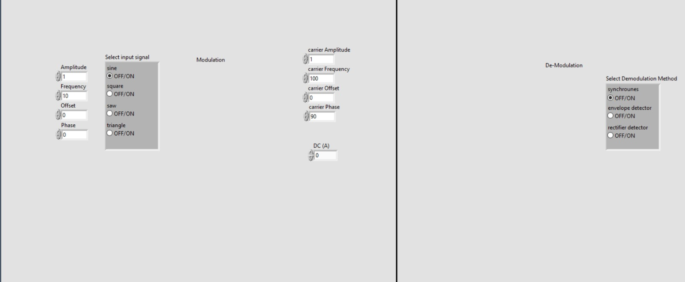
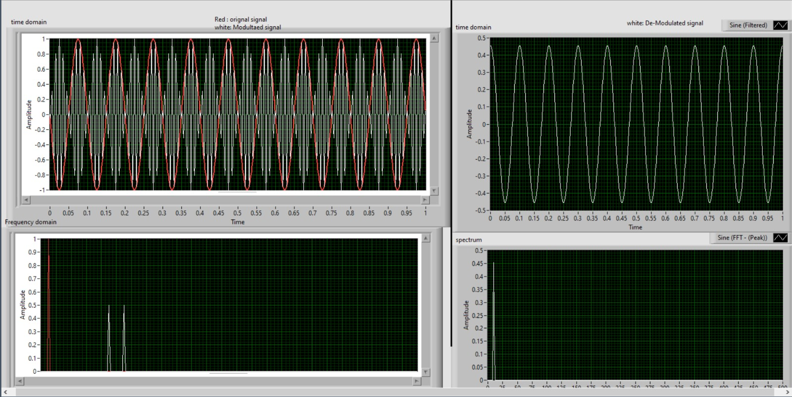
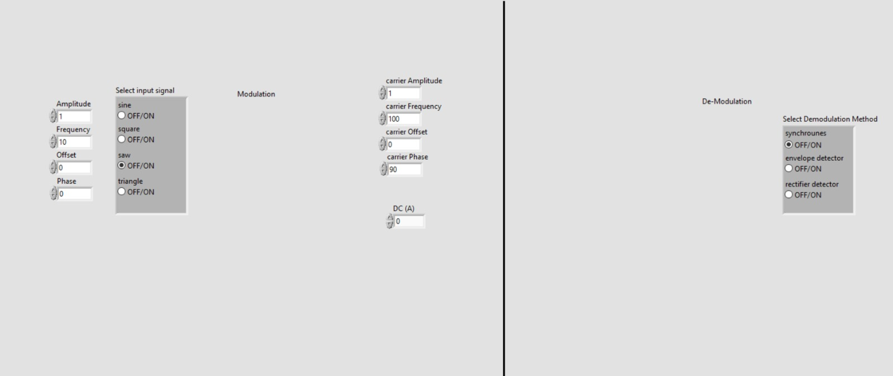
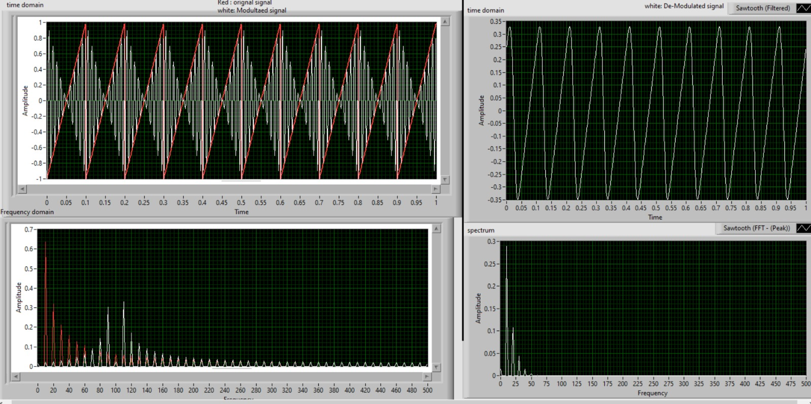

# AM-signal-Modulation-Demodulation
LABView project showing different modualtion and de-modualtion configuarion of AM signal

## Input signal configuration

1. Sine
2. Square
3. Saw
4. Triangle

You can edit the following paramters for input signal

1. Amplitude
2. Frequency
3. Offset
4. Phase

## Carrier signal configuration

Carrier signal is basically a sine wave with high frequency 
You can edit the following paramters for carrier signal

1. Amplitude
2. Frequency
3. Offset
4. Phase
5. DC value

## De-modulation Techniques

1. Synchronous (coherent)
2. Envelope detector
3. Rectifier detector

## Examples

### sine-signal-config

### sine-signal-View

### saw-signal-config

### Saw-signal-View

